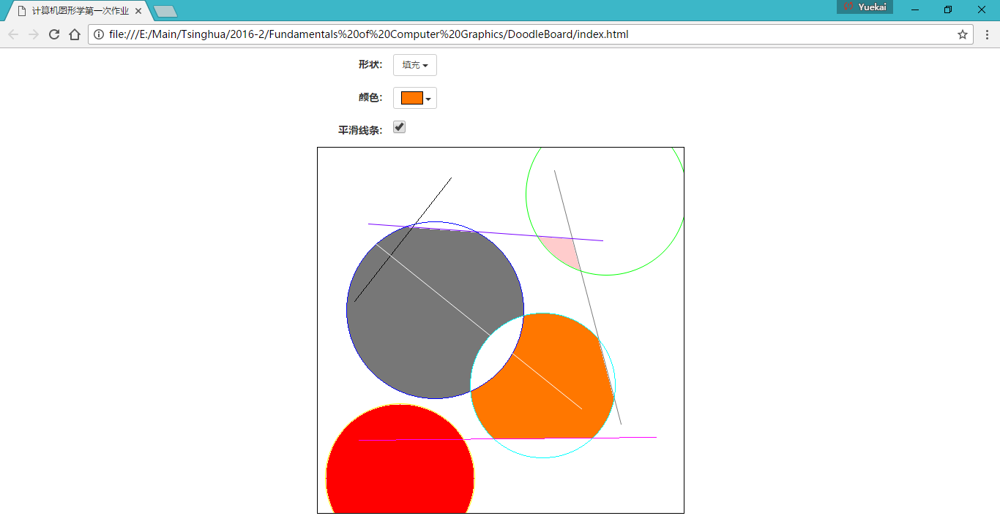
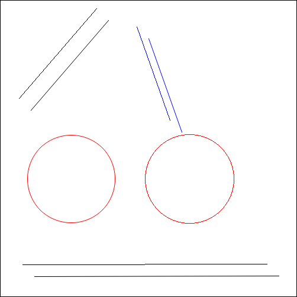
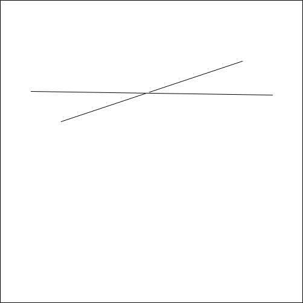
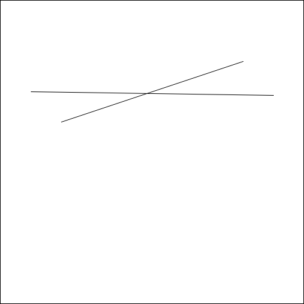

# 计算机图形学第一次作业报告

## 简介
这次作业，我是用 HTML + JavaScript 完成的，其中 HTML 主要用来快速制作图形界面，JavaScript 用来实现光栅化算法。我实现的光栅化算法包括：
1. 画线
2. 画圆
3. 区域填充
4. 线条反走样

## 功能介绍
如图所示，整个项目的主界面是个网页，使用任意一款现代浏览器打开 [`index.html`](index.html) 就可以运行。



点击“**形状**”下拉菜单可以选择形状，可用的三种形状分别为“**线段**”、“**圆**”和“**填充**”，分别对应画线段、画圆和区域填充功能：
* 鼠标点击正方形区域中某点固定其中一端点，再点击另一点确定另一端点，即可画线段；
* 鼠标点击正方形区域中某点固定圆心，再点击另一点确定圆上的某点，即可画圆；
* 鼠标点击正方形区域中某点，即可把与该点同色的四连通的所有点都填充为当前颜色。

点击“**颜色**”下拉菜单可以选择形状的颜色，当形状为“线段”或“圆”时，将以该颜色画线或圆周；当形状为“填充”时，将以该颜色进行填充。

点击“**平滑线条**”复选框可以打开或关闭平滑线条功能，当打开该功能时，将会用反走样算法来画线；当关闭该功能时，将会用普通算法来画线。

## 项目结构
整个项目的文件结构如下图所示：
```
DoodleBoard/
├── lib/                        // 外部库
│   ├─── jquery-3.1.1.min.js
│   ├─── bootstrap.min.js
│   └─── bootstrap.min.css
├── js/
│   ├─── graph.js               // Graph 类
│   └─── draw.js                // 主程序
├── css/                        // 样式
├── img/                        // 本报告引用的图片
├── index.html                  // 主界面网页文件
├── report.html                 // HTML 格式的报告
├── report.md                   // Markdown 格式的报告
└── README.md                   // Github Readme 文件
```
项目的核心代码位于 [**`graph.js`**][graph.js] 和 [**`draw.js`**][draw.js]  中，其中 [`graph.js`][graph.js] 实现了一个简单的图形类 Graph，并实现了各种光栅化算法。[`draw.js`][draw.js] 包含了对各种事件的处理，以及通过调用 Graph 中的函数来绘制图形。

[graph.js]: <js/graph.js>
[draw.js]: <js/draw.js>

## 界面
界面部分主要用 HTML 实现，并使用了 [jQurey](http://jquery.com/) 和 [Bootstrap](http://getbootstrap.com/) 库，使得开发过程更为方便、快捷。

本项目核心——画图板，是用 HTML5 的 **`<canvas>` 元素**结合 JavaScript 来实现的。Canvas 中自带了部分画线、画圆的函数，本项目并没有用到，而是使用 `Context.getImageData()` 和 `Context.putImageData()` 函数，先获取从当前 Canvas 导出的图像数据，然后对该图像进行像素操作，最后再放到 Canvas 上。

画图过程中一些鼠标事件的处理用的是 [jQurey](http://jquery.com/)。

## 算法
本项目并没有用到 Canvas 中自带的画线、画圆函数，所有光栅化算法匀重新实现。

### 画线
画线用的是书中 **Bresenham 算法**，实现在 [`graph.js`][graph.js] 中的 `__drawLine()` 函数，具体细节不再描述。(书中给出的代码只能画 `0 <= k <= 1` 的线，对于其他情况需进行讨论)

### 画圆
画圆用的是书中的**中点画圆算法**，实现在 [`graph.js`][graph.js] 中的 `__drawCircle()` 函数，具体细节不再描述。

### 区域填充
区域填充用的是书中的**扫描线区域填充算法**，实现在 [`graph.js`][graph.js] 中的 `fill()` 函数，具体细节不再描述。

### 反走样
线条的反走样用的是[**吴小林直线算法**](https://en.wikipedia.org/wiki/Xiaolin_Wu%27s_line_algorithm)，能够又快又好地处理线段和圆弧的反走样。没有经过反走样和经过反走样的线段和圆的比较如下图所示：



该算法从中点画线算法改进而来。普通的中点画线算法处理当前横坐标时，是通过比较当前纵坐标的小数部分与 `0.5` 的大小，来决定是在 `(x, floor(y))` 还是 `(x, floor(y) + 1)` 画点，而吴小林算法，是两个点都要画，只是亮度不同。

设当前纵坐标 `y` 的整数部分为 `a = floor(y)`， 小数部分为 `b = y - a`，则 `(x, a)` 与 `(x, a + 1)` 这两个点的亮度之比为 `1 - b : b`。具体画点时，可通过设置像素的 Alpha 通道(透明度)来设置亮度。

对于画圆也类似，都是根据当前纵坐标的小数部分决定两个点的亮度。

对于该算法的效率，由于需要用到纵坐标的小数部分，实数操作不可避免，无法像 Bresenham 算法一样全通过整数操作完成，但是由于算法简洁，效率差别不是很明显。

对于其他反走样算法(SSAA，加权区域采样)，我也实现过，但是效率和质量均没有吴小林算法好。

### 相交线的反走样
如果直接用上述算法进行反走样，对于相交线段(或线段与圆，圆与圆)，由于画线时某些点亮度会很高，当覆盖前一条的线段的像素时，就有可能会出现像是线条“断开”的情况，如下图所示：



为了解决这个问题，需要用到**颜色混合**的相关知识，基本思想为：当一个像素即将覆盖另一个像素时，不直接覆盖，而是把该点颜色设为这两个像素点的混合色。

具体算法为：设屏幕上已存在的点为 A，其 RGB 值分别为 `r(A), g(A), b(A)`，将要覆盖上去的点为 B，其 RGB 值分别为 `r(B), g(B), b(B)`，Alpha 通道值为 `a` (0~1)，则两点混合后的产生的新点 C 的 RGB 值分别为
```
r(C) = (1 - a) * r(B) + a * r(A)
g(C) = (1 - a) * g(B) + a * g(A)
b(C) = (1 - a) * b(B) + a * b(A)
```
使用了颜色混合后，上面两条线段相交的情况如下图所示：


